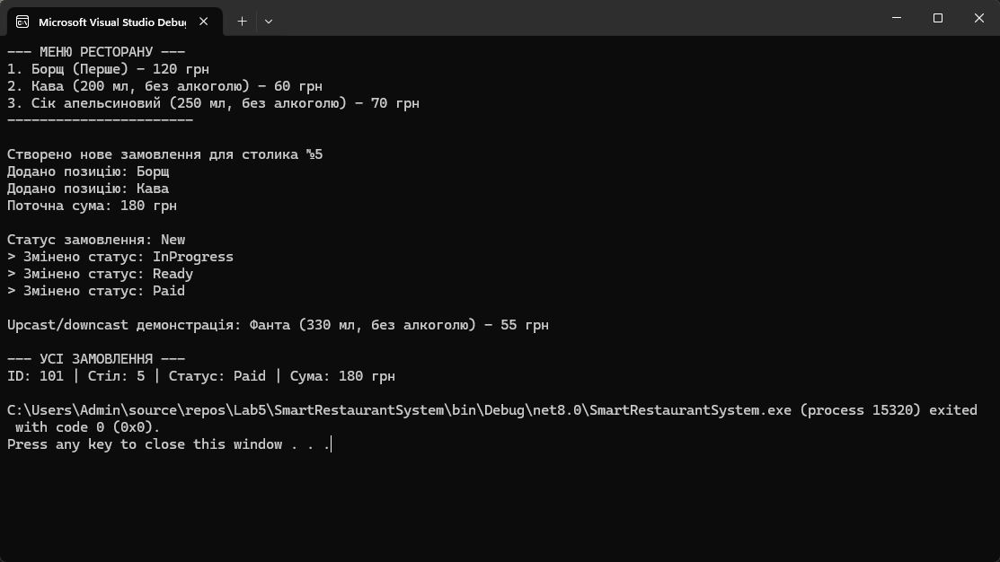

# Лабораторні роботи | C# ООП
## Лабораторна робота 5

[Головна сторінка](https://github.com/KyivSec/cslabs)

- [Лабораторна робота №1](https://github.com/KyivSec/cslabs/tree/lab1)
- [Лабораторна робота №2](https://github.com/KyivSec/cslabs/tree/lab2)
- [Лабораторна робота №3](https://github.com/KyivSec/cslabs/tree/lab3)
- [Лабораторна робота №4](https://github.com/KyivSec/cslabs/tree/lab4)
- [Лабораторна робота №5](https://github.com/KyivSec/cslabs/tree/lab5)
# App Preview

# Files
- [Program.cs](SmartRestaurantSystem/Program.cs)
- [Restaurant.cs](SmartRestaurantSystem/Restaurant.cs)
- [Order.cs](SmartRestaurantSystem/Order.cs)
- [MenuItem.cs](SmartRestaurantSystem/MenuItem.cs)
- [Food.cs](SmartRestaurantSystem/Food.cs)
- [Drink.cs](SmartRestaurantSystem/Drink.cs)
- [OrderStatus.cs](SmartRestaurantSystem/OrderStatus.cs)
