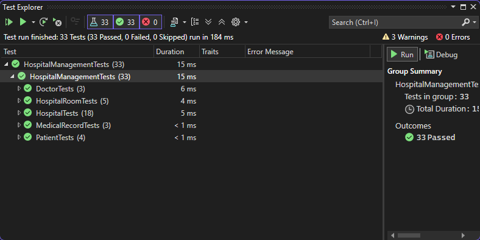

# 🖥️ Лабораторні роботи | C# ООП
## 📝 Лабораторна робота №2

[📌 Головна сторінка](https://github.com/KyivSec/cslabs)

- [📝 Лабораторна робота №1](https://github.com/KyivSec/cslabs/tree/lab1)
- [📝 Лабораторна робота №2](https://github.com/KyivSec/cslabs/tree/lab2)
- [📝 Лабораторна робота №3](https://github.com/KyivSec/cslabs/tree/lab3)
- [📝 Лабораторна робота №4](https://github.com/KyivSec/cslabs/tree/lab4)
- [📝 Лабораторна робота №5](https://github.com/KyivSec/cslabs/tree/lab5)
# ✅ Результати тестування

# 📁 Файли
- [📄 Program.cs](HospitalManagementSystem/Program.cs)
- [📄 HospitalDemo.cs](HospitalManagementSystem/HospitalDemo.cs)
- [📄 Hospital.cs](HospitalManagementSystem/Hospital.cs)
- [📄 Doctor.cs](HospitalManagementSystem/Doctor.cs)
- [📄 Patient.cs](HospitalManagementSystem/Patient.cs)
- [📄 HospitalRoom.cs](HospitalManagementSystem/HospitalRoom.cs)
- [📄 MedicalRecord.cs](HospitalManagementSystem/MedicalRecord.cs)
