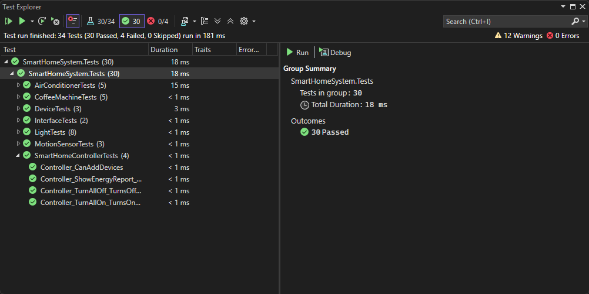

# 🖥️ Лабораторні роботи | C# ООП
## 📝 Лабораторна робота №4

[📌 Головна сторінка](https://github.com/KyivSec/cslabs)

- [📝 Лабораторна робота №1](https://github.com/KyivSec/cslabs/tree/lab1)
- [📝 Лабораторна робота №2](https://github.com/KyivSec/cslabs/tree/lab2)
- [📝 Лабораторна робота №3](https://github.com/KyivSec/cslabs/tree/lab3)
- [📝 Лабораторна робота №4](https://github.com/KyivSec/cslabs/tree/lab4)
- [📝 Лабораторна робота №5](https://github.com/KyivSec/cslabs/tree/lab5)
# ✅ Результати тестування 

# 📁 Файли
- [📄 Program.cs](SmartHomeSystem/Program.cs)
- [📄 SmartHomeController.cs](SmartHomeSystem/SmartHomeController.cs)
- [📄 Device.cs](SmartHomeSystem/Device.cs)
- [📄 ISwitchable.cs](SmartHomeSystem/ISwitchable.cs)
- [📄 IEnergyConsumer.cs](SmartHomeSystem/IEnergyConsumer.cs)
- [📄 Light.cs](SmartHomeSystem/Light.cs)
- [📄 AirConditioner.cs](SmartHomeSystem/AirConditioner.cs)
- [📄 CoffeeMachine.cs](SmartHomeSystem/CoffeeMachine.cs)
- [📄 MotionSensor.cs](SmartHomeSystem/MotionSensor.cs)
